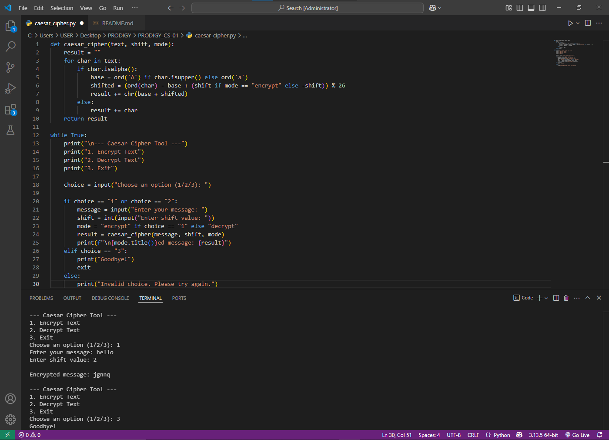

## PRODIGY INFOTECH CYBERSECURITY INTERNSHIP ##
# Task 1: Caesar Cipher – Text Encryption & Decryption Tool

This Python project implements a classic Caesar Cipher, which encrypts or decrypts messages by shifting the alphabet by a fixed number of positions. It's presented in a user-friendly, menu-driven format for smooth interaction.

## 🔧 Features
- Encrypt or decrypt any message using a shift key
- Menu-driven interface with clear prompts
- Preserves special characters and spacing
- Handles both uppercase and lowercase letters

## ▶️ How to Run
1. Open the terminal in your project folder.
2. Run the script: [caesar_cipher.py]
3. Follow the on-screen menu to:
    - Encrypt a message
    - Decrypt a message
    - Exit the program

## 📌 Example
Message: Hello World!
Shift: 3
Encrypted: Khoor Zruog!

## 📸 Preview

## 📝 Note
This program uses simple substitution logic and is ideal for learning basic cryptography concepts.